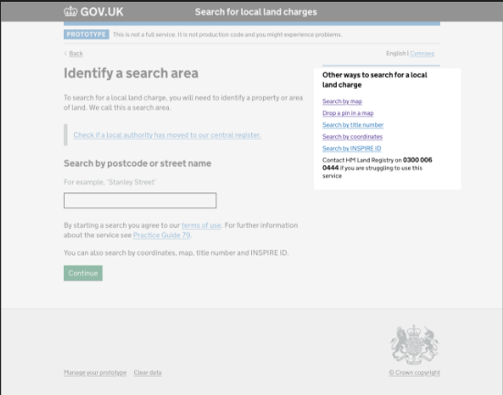
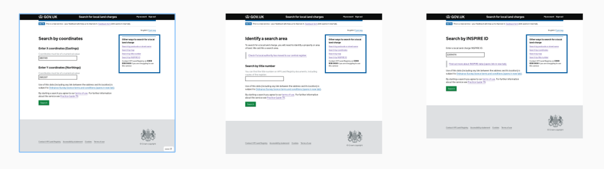
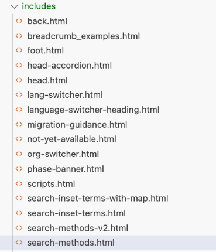
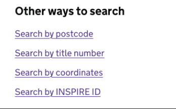

# Prototype kit “includes”

## How to re-use content with includes

Create code that can be re-used, eg across a journey

For example, a list of links to alternative search methods. We can re-use the same code and then eg change the copy or add another item in a single place to update all pages at once.

The same content can be quickly re-used across multiple pages

## Code

Create a html file in the app/views/includes [folder](https://github.com/LandRegistry/llc-prototype/tree/main/app/views/includes)

Add sample code to the [html file](https://github.com/LandRegistry/llc-prototype/blob/main/app/views/includes/search-methods.html)

    <aside class="app-related-items govuk-!-margin-bottom-" role="complementary"> 
      <h2 class="govuk-heading-s" id="subsection-title"> 
        Other ways to search for a local land charge 
      </h2> 
      <nav role="navigation" aria-labelledby="subsection-title"> 
        <ul class="govuk-list govuk-list--spaced govuk-!-font-size-16"> 
          <li><a href="search-by-map">Search by map</a></li> 
          <li><a href="search-by-title-number">Search by title number</a></li> 
          <li><a href="search-by-coordinates">Search by coordinates</a></li> 
          <li><a href="search-by-inspire-id">Search by INSPIRE ID</a></li> 
          <li>Contact HM Land Registry on <b>0300 006 0444
          </b> if you are struggling to use this service</li> 
        </ul> 
      </nav> 
    </aside> 

In the actual [pages where this content is needed](https://github.com/LandRegistry/llc-prototype/blob/7f304b39bd066b9d9a4b7b506a68e65604494275/app/views/search/sprint-54/map-less/search.html#L90-L92), include the above html using nunjucks, eg
    
    
 
      
    
 

## Part two: conditional content

By setting a variable in the parent page (eg we can set the variable to describe the method of search), we can then display content as required by the parent, so in this example, we can displaying the whole list but skip the list item for _search by map_ on the _map_ page.

Create a second version of the search-methods.html ([search-methods-v2.html](app/views/includes/search-methods-v2.html)!)

Edit that file to add [conditional nunjucks code](https://github.com/LandRegistry/llc-prototype/blob/7f304b39bd066b9d9a4b7b506a68e65604494275/app/views/includes/search-methods-v2.html#L7-L9). This will hide the specific list item for that method variable
    

     
      <li><a href="search-by-map">Search by map</a></li> 
     

    
Back in the parent [search-by-map](https://github.com/LandRegistry/llc-prototype/blob/7f304b39bd066b9d9a4b7b506a68e65604494275/app/views/search/sprint-54/results-page/search-by-map.html#L41-L42) file, (see also [search-by-title-number](https://github.com/LandRegistry/llc-prototype/blob/7f304b39bd066b9d9a4b7b506a68e65604494275/app/views/search/sprint-54/results-page/search-by-title-number.html#L37-L38) and [search-by-coordinates](https://github.com/LandRegistry/llc-prototype/blob/7f304b39bd066b9d9a4b7b506a68e65604494275/app/views/search/sprint-54/results-page/search-by-coordinates.html#L44-L45)) set the appropriate method as a nunjucks variable, eg

    
 
       
       
    
 
    
When this [page](https://local-land-charges-prototype-34f998edd91e.herokuapp.com/search/sprint-54/results-page/search-by-map) is displayed in the browser, the map list item is skipped over and does not display:

