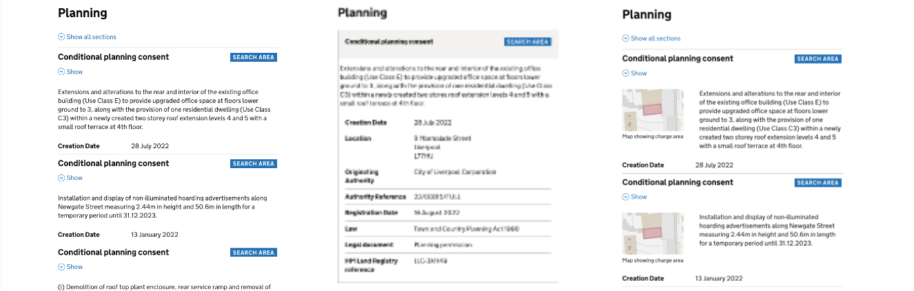

# Server side data

## How to use json data for dynamic pages

Load an external file of dummy data to provide realistic data for pages.

For example, use a list of anonymised LLC data to test results pages.
The same content can be quickly re-used across multiple pages.

## Code

Create a json file in the app/data [folder](https://github.com/LandRegistry/llc-prototype/tree/main/app/data).

Find and format the data. (I carried out a live search to see the data fields that were being returned as part of the search, then formatted the data into json, with an object for each result and key-values for each field. I then anonymised the data)

Add the sample data to the [file](https://github.com/LandRegistry/llc-prototype/blob/main/app/data/sample-charges.json).

Add the new data into the [session-data-defaults.js](https://github.com/LandRegistry/llc-prototype/blob/main/app/data/session-data-defaults.js#L20C1-L20C47), so that the data is loaded when the prorotpye starts and is then avialable to use on a page.

    var charges = require('./sample-charges.json')
    // we can then refer to this as `data.charges` later

  I also added `console.log(charges);` to show the data in the terminal as a check that it is working.

In the actual [pages where this content is needed](https://github.com/LandRegistry/llc-prototype/blob/7f304b39bd066b9d9a4b7b506a68e65604494275/app/views/search/sprint-54/map-less/search.html#L90-L92), create a `for` loop using nunjucks, eg
    
    
      ...code to be duplicated goes here
    

where:
+ `data` is the session data
+ `data.charges` is the imported sample-charges.json
+ `data.charges.categories` refers to the array inside the sample-charge.json
+ `data.charges.categories[0]` is the first object inside that array
+ `data.charges.categories[0].charges` is the array of charges for that first item in the categories array

## Adding data inside the loop 

Within the nunjucks for-loop, we can then use the individual field values in the data on the page eg 

    <h2 class="govuk-summary-card__title">{{ each_item.subcategory }}</h2>

    
{{ each_item.description }}

Using this we can dynamically populate pages and eg test different presentation options: [summary cards](https://local-land-charges-prototype-34f998edd91e.herokuapp.com/search/sprint-54/results-page/summary-card) or [accordion](https://local-land-charges-prototype-34f998edd91e.herokuapp.com/search/sprint-54/results-page/accordion).

## Further information

[Nunjucks Templating Documentation](https://mozilla.github.io/nunjucks/templating.html#for)

[Nunjucks advanced loops](https://giuliachiola.dev/posts/nunjucks-advanced-loops/)

 
    
